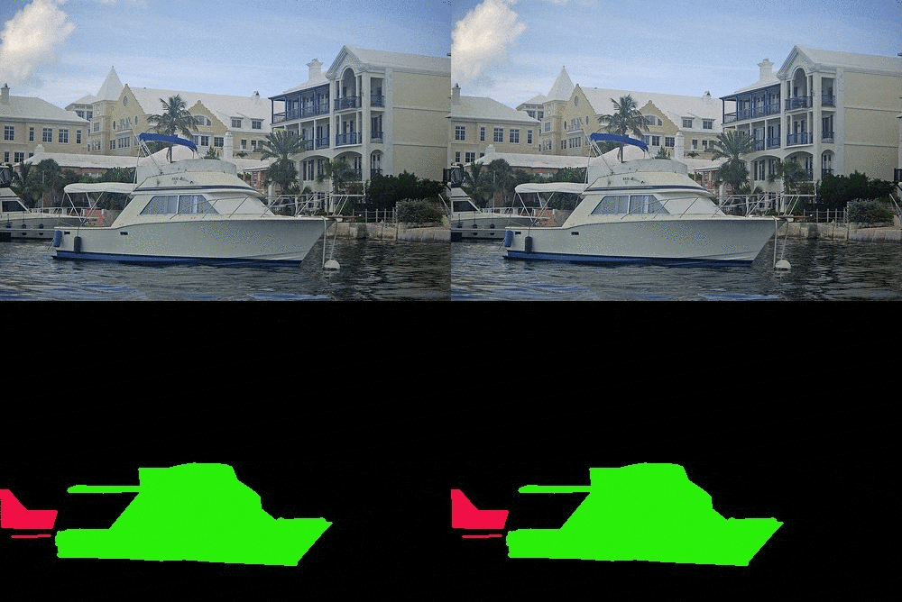

# dream-augmentations
* Lot of creative ideas originate from dream because, dreams and dreamers do not have any reality barriers.
* Similarly following augmentation synthesize image without holding reality, perceptual or context ideas.
* Ironically, model train without context or perceptual bias helps to develop better feature representations which can later fine tuned with original images.

[run colab demo](https://colab.research.google.com/github/vishnu-chand/complex-augmentation/blob/main/dreamAugmentations.ipynb)

#### For copy paste augmentation code is copied and modified from https://arxiv.org/abs/2012.07177
* Augmentation can be described as a technique to generate an arbitrary sample from give data distribution
* Usually most of the augmentation technique can use only intra-class data distribution
* Whereas copy paste augmentation, can generate data using inter-class distribution and helps to crate a robust feature descriptor

